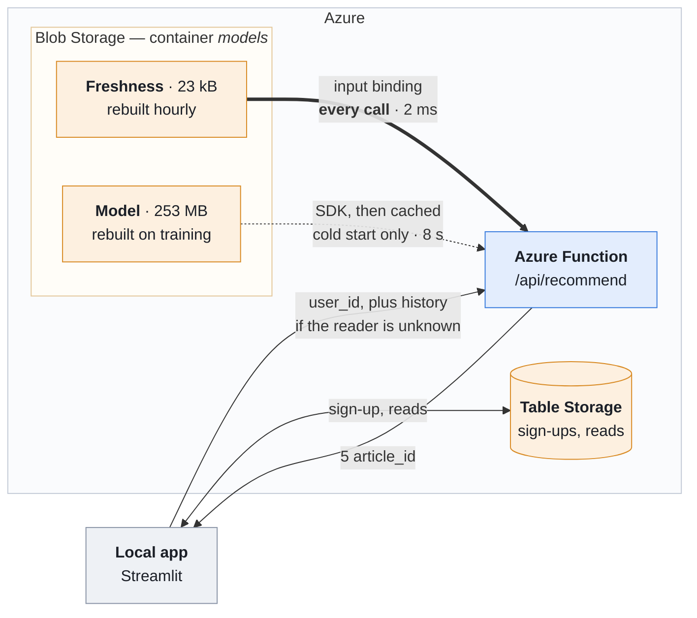
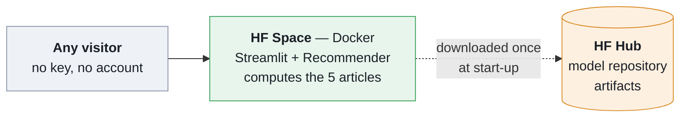
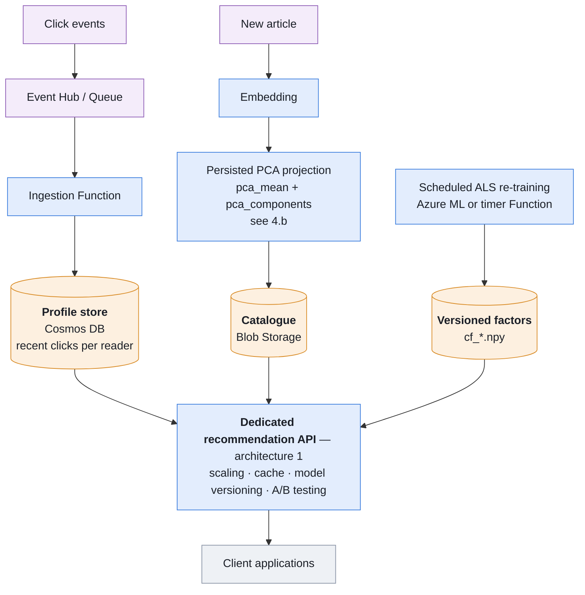

# Ricochet — technical and functional architecture

> Scope: the technical and functional architecture of the recommendation MVP,
> and the target architecture that would absorb a continuous stream of new
> readers and new articles.
>
> This is the synthesis note requested as a project deliverable. People named in
> the assignment brief are deliberately left out — this repository is public.

---

## 1. Functional description (as built)

**MVP user story**: *as a reader, I am given a selection of 5 articles.*

The path a request takes today:

1. The reader (or we, through the demo app) picks a `user_id`.
2. The application calls one HTTP endpoint — an Azure Function.
3. The Function computes 5 recommendations and returns them.
4. The app displays the 5 articles.

## 2. The recommender

Several strategies behind a single service:

| Strategy | Principle | Strength | Limit |
|-----------|----------|-------|--------|
| **Content-based** | reader profile = mean of the embeddings of the articles read, then cosine against the catalogue | works from the very first click; handles a **new article** immediately, since it has an embedding | ignores collective signal |
| **Collaborative (ALS)** | factorisation of the reader × article matrix (implicit feedback) | captures latent taste, gives an element of surprise | **cold start**: useless for a new reader or a new article |
| **Hybrid** | normalised blend of both scores | combines both, degrades cleanly | two models to keep in step |
| **Mix** *(in production)* | 4 slots from the last hour of popularity + 1 content slot drawn from a 6 h candidate pool | best measured HitRate@5, and always fresh | depends on the freshness artifacts being current |

**Cold start**: when a reader has no usable history, the service returns the
**most popular articles**. That is the MVP's safety net, and the service is
never allowed to return an empty list.

**Production constraint from the brief**: the embeddings (250 dimensions) are
reduced by **PCA** to about 50 dimensions offline, so that the artifacts fit
inside Azure's free quotas.

## 3. Deployment architecture — two independent solutions

> The dynamic view — who calls whom, in what order, and what a cold start
> costs — is in [`sequences.md`](sequences.md), as one UML sequence diagram per
> deployment.

The same recommendation core (`src/recommender.py`) and the same artifacts feed
**two self-contained deployments**.

### 3.a — Azure (serverless, the industrialisable one)

This is *architecture 2* of the brief: serverless with no dedicated API, the
Function reading the models straight out of Blob Storage.



Two arrows leave Blob Storage, and that is the whole point of the figure: the
23 kB of freshness data and the 253 MB of model artifacts do **not** travel the
same way. The thick arrow is paid on every call; the dashed one is paid once per
instance. A diagram that merged them would describe architecture 2 as it is
*suggested*, not as it is *implemented* — the measurements that forced the split
are below.

#### Two ways into Blob Storage, each where it is the better one

The brief suggested the *blob input binding*: the Function declares the file it
needs, the host reads it and passes it in as a parameter — no SDK, no download
code. Applied to **every** artifact this would backfire. The binding re-reads
the blob **on every invocation**, and the catalogue, the histories, the stars
and the factors weigh 253 MB together. The cold-start cache would disappear and
every single call would pay for the download: about 8 s measured, against about
200 ms today, a factor of 40.

Rejecting it everywhere costs something else, though. The three **freshness**
artifacts change every hour, and an in-memory cache is only refreshed by
`az functionapp restart` — the service would keep serving the window it started
with, indefinitely. On those files the binding is exactly the right tool.

Hence the split that was kept:

| Artifacts | Size | Cadence | Access | Cost per call |
|---|---|---|---|---|
| `popular_recent.npy`, `candidates_recent.npy`, `recent_window.json` | 23 kB | hourly | **blob input binding** | about 2 ms |
| PCA catalogue, histories, stars, segmented popularity, factors | 253 MB | on re-training | SDK, then cached at cold start | 0 (cached) |

The binding applies **after** the engine is initialised: `set_freshness()`
(`src/recommender.py`) swaps the window on each invocation. The same three files
are still downloaded by the SDK as well — not out of pointless redundancy, but
as a **fallback**: if a binding read fails, `_rafraichir()` logs a warning and
the engine keeps the window it started with. 23 kB paid once, so that the
degradation stays graceful.

**Verified in production**, with no restart:

```
first call                          -> 211442, 50644, 36162, 156279, 159938
popular_recent.npy replaced in Blob (no restart)
next call                           -> 209122, 224730, 205824, 70986, 159938
```

The four popularity slots follow the new file; the fifth — the content slot,
drawn from an unchanged `candidates_recent.npy` — does not move. That is the
proof that freshness really is re-read on every call, and that the heavy
artifacts really do stay cached.

### 3.b — Hugging Face (public demo, self-sufficient)

A Space **embeds** the Recommender and computes the recommendations in place,
loading the artifacts from an HF Hub model repository — the HF equivalent of
Blob Storage. It never calls Azure: the two solutions are independent.



**Why two solutions**: Azure carries the *industrialisable, serverless*
argument; Hugging Face carries the *public demo* that is easy to hand to
someone. Both start from the same artifacts, produced offline by
`src/prepare_model.py` (raw data → PCA + ALS → artifacts). Inference itself
depends on nothing but numpy.

### Repository components

| Directory | Role |
|---------|------|
| `src/` | recommendation core and artifact preparation — the source of truth |
| `notebooks/` | exploration and model comparison |
| `azure_function/` | **the Azure solution**: the serverless service (architecture 2) |
| `app/` | local Streamlit app calling the Azure Function |
| `spaces/` | **the Hugging Face solution**: a self-sufficient Space |
| `models/` | generated artifacts, pushed to Blob **and** to HF Hub |
| `infra/` | the Azure stack as Terraform code |

## 4. Target architecture (new readers, new articles)

The MVP recomputes everything offline, in batch. At scale, novelty has to be
**absorbed continuously** instead. This is the decisive point for the product: a
news portal publishes all the time, and most of its audience is barely known or
not known at all.

### 4.a — What each kind of novelty costs

| Event | What has to be recomputed | Achievable latency | Re-training? |
|---|---|---|---|
| **New article** | its embedding, its PCA projection, its row in the catalogue | minutes | **no** |
| **New click** (known reader) | the profile, i.e. the mean of the embeddings read — computed on demand | real time | **no** |
| **New reader** | nothing before the first click (popularity), then a content profile | real time | **no** |
| *Collaborative* coverage of a new reader | that reader's latent factors | hours (fold-in) to a day (batch) | yes, partial or full |
| Catalogue drift (genuinely new topics) | re-fitting the PCA, then recomputing the whole catalogue | scheduled, e.g. monthly | yes, full |

The important reading of this table: **only the collaborative part forces a
re-training**. The two immediate needs — a new article visible at once, a new
reader served from the first click — are covered by the content-based model,
provided two prerequisites hold. Those are the next two subsections.

### 4.b — Prerequisite 1: the PCA projection must be persisted

The catalogue is reduced from 250 to 50 dimensions by PCA. A new article arrives
with a 250-dimension embedding, and to be comparable with the others it must be
placed in **the same basis**. A re-fitted PCA produces a *different* basis: every
vector already stored would become incomparable and would have to be recomputed
— 364 k articles — along with any index built on top of them.

`src/prepare_model.py` therefore serialises the projection itself, next to the
reduced catalogue:

| Artifact | Content | Size |
|---|---|---|
| `articles_embeddings_pca.npy` | the reduced catalogue, read at inference time | about 73 MB |
| `pca_mean.npy` + `pca_components.npy` | **the projection**: mean and axes | about 51 kB |

Ingesting an article then becomes a local operation, with no re-training. The
repository ships the whole path:

```bash
python scripts/add_articles.py --embeddings new.npy --dry-run   # check
python scripts/add_articles.py --embeddings new.npy             # ingest
```

The script projects the embeddings, appends them to the catalogue with an
**atomic write**, and prints the `article_id` values assigned — identifiers are
row indices in the catalogue. A guard refuses an ingestion that has already been
performed, by row fingerprint, so that re-running it introduces no duplicates.

As a library, the projection alone:

```python
from src.prepare_model import project_embeddings
vector = project_embeddings(raw_embedding, models_dir)   # (1, 50), numpy only
```

Checked against the real catalogue: 3 added articles receive identifiers
364047–364049 and **enter the top-5 immediately** for a reader they are close
to, without any model being re-trained.

Those 51 kB are what separates "a new article ingestible in minutes" from "a new
article requiring a full catalogue rebuild". The trade-off is real: the PCA basis
stays the one fitted on the original corpus, so genuinely new topics are
represented less and less well — today 50 components account for 94.5 % of the
explained variance. Hence the **scheduled re-fit** on the last row of table 4.a,
with a versioned artifact and an atomic switchover.

### 4.c — Prerequisite 2: profiles must move out of the artifacts

Today `user_clicks.pkl` is a **snapshot of a batch**: read-only, and loaded into
the memory of every instance. That choice does not survive into the target, for
two independent reasons — there is no write path for a click that has just
happened, and the history of every reader cannot live inside the inference
process.

In the target, a profile becomes an **indexed read** against a store, Cosmos DB
or Table Storage: a reader's recent clicks — a window of N articles is enough
for a content profile — written by event ingestion, read by the recommendation
service. Consequences:

- `user_clicks.pkl` disappears from the served artifacts;
- `popular_articles.npy` is recomputed over a **sliding window** rather than the
  whole history, so the cold-start fallback becomes "popular *right now*", which
  is the only useful definition for news;
- the `cf_*` factors remain versioned artifacts, produced in batch.

### 4.d — The collaborative model: fold-in, then batch

ALS is not incremental *in the strict sense*, but one reader's factors can be
solved against the existing article factors without relearning everything —
`partial_fit_users` in the `implicit` library. That gives a gradation:

1. **real time** — content-based, from the first click;
2. **a few hours** — ALS fold-in: the reader enters the collaborative model
   without a full re-training;
3. **scheduled** — a full re-training, which realigns all the factors.

Between two re-trainings, any reader or article absent from the factors falls
back cleanly to content-based, then to popularity. The degradation is explicit
and already implemented in `recommend()`.

### 4.e — Target flow



### 4.f — Cadences and ownership

| Job | Trigger | Component | Artifact touched |
|---|---|---|---|
| Projecting a new article | publication | ingestion Function | `articles_embeddings_pca.npy` |
| Writing a click | event | Event Hub → Function | profile store |
| Sliding popularity | hourly | timer Function | `popular_articles.npy` |
| ALS fold-in | hourly | timer Function | reader factors |
| Full ALS re-training | daily | Azure ML / batch | versioned `cf_*.npy` |
| PCA re-fit | monthly, plus explained-variance monitoring | Azure ML / batch | catalogue and projection, versioned |

Other target decisions:

- **Move to architecture 1, a dedicated API**, once traffic grows: application
  and model decoupled, scaled independently, with a cache, A/B testing and
  proper model **versioning**.
- **Candidate generation**: the MVP scores the entire catalogue on every call —
  364 k dot products. In the target, an approximate-nearest-neighbour index
  narrows this to a few hundred candidates before ranking.
- **Recency**: weighting by article age, absent from the MVP and yet structural
  for news.
- **Monitoring**: Application Insights for latency and error rate, plus business
  metrics — click-through rate on the recommendations — to steer the iterations.

### 4.g — What is actually implemented at this stage

So that the MVP's perimeter is unambiguous:

| Target element | State |
|---|---|
| Persisted PCA projection and projection function | **implemented** (`project_embeddings`, tested) |
| **Ingesting a new article** (projection and catalogue append) | **implemented, in batch** (`scripts/add_articles.py`, tested) |
| Degradation collaborative → content → popularity | **implemented** (`recommend()`) |
| **Refreshing the freshness window without a restart** | **implemented** (blob input binding and `set_freshness()`, verified in production) |
| *Event-driven* trigger for that ingestion (Event Hub → Function) | designed, not implemented |
| Profile store, click writes | designed, not implemented |
| ALS fold-in, scheduled re-trainings | designed, not implemented |
| ANN index, recency, model versioning | designed, not implemented |

The MVP is a **demonstrator of the recommendation engine**, not a production
service: it implements the ranking function and documents the chain that would
still have to be built.

## 5. Known limits and next steps

- No confidence interval on the strategy comparison yet: 0.2500 against 0.2525
  HitRate@5 is a difference the current protocol cannot call significant.
- No recency weighting on articles, only the freshness window.
- No custom Application Insights metric: latency and errors are visible, the
  business signal is not.
- Security: a function key is enough for the MVP, real authentication is not.
- Deployment is still manual (`func azure functionapp publish`), and Terraform
  describes the stack without yet owning it — see
  [`../infra/README.md`](../infra/README.md).
