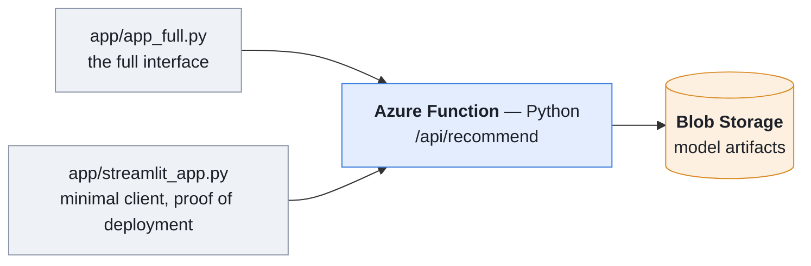

# Tutorial — deploying Ricochet on Azure, from nothing to a live service

A complete, reproducible procedure written from a real deployment. Every value,
duration and error mentioned here was actually observed.

**What you end up with**: an HTTP recommendation service and two applications
that use it.



Total time: **about an hour**, half of it spent waiting — building the
artifacts, uploading, deploying.

---

## Step 0 — What you need before starting

| Item | Check | If missing |
|---|---|---|
| An Azure account **with a subscription** | `az account list --all -o table` must show an `Enabled` row | <https://azure.microsoft.com/free> (a bank card is required for identity verification) |
| Azure CLI | `az version` | `winget install -e --id Microsoft.AzureCLI` |
| Functions Core Tools | `func --version` → `4.x` | `winget install -e --id Microsoft.Azure.FunctionsCoreTools` |
| Python 3.13 | `python --version` | must match the runtime chosen in step 5 |
| The Globo dataset | `data/news-portal-user/clicks/` | see `data/README.md` |

After installing Core Tools, **close and reopen the terminal**: `PATH` is not
refreshed in a session that is already open. That is the most common cause of
`func` not being found right after installation.

Every command runs **from the repository root** unless stated otherwise.

---

## Step 1 — Build the artifacts

The service computes nothing on demand: it reads artifacts produced offline.

```powershell
pip install -r requirements.txt

python -m src.prepare_model --data-dir data/news-portal-user --out-dir models
python -m src.collaborative_surprise --data-dir data/news-portal-user --out-dir models
```

Expect about **twenty minutes**: PCA over 364 047 articles, ALS over 3 million
clicks, then SVD over roughly 15 million examples (the clicks, plus 4 sampled
negatives per click).

The second command produces the SVD variant **retained** by notebook 06: binary
ratings with sampled negatives. That has been the default since a badly chosen
default showed what it costs. It used to be "article stars, no negatives" — that
is, the variant the study rejects, whose HitRate@5 is zero, because a rating that
depends only on the article cannot rank anything for a particular reader. Since
the command above carries no flags, it produced exactly that model, and the
application's "SVD Surprise" button served it, without a single error being
raised. To reproduce the old variant for comparison: `--rating stars
--negatives 0`.

Expected result — **22 artifacts, about 253 MB**, plus three files that are not
published: `.gitkeep`, and the two measurement records `baseline_metrics.json`
(the quality gate's reference) and `freshness_sweep.json` (the effect of the
window). So the total count is 25.

```powershell
Get-ChildItem models -File | Measure-Object -Property Length -Sum |
  ForEach-Object { "{0} files, {1:N0} MB" -f $_.Count, ($_.Sum / 1MB) }
```

Two parameters determine the quality of the service:

| Parameter | Default | Role |
|---|---|---|
| `--window-hours` | 1 | window of the popularity ranking. **The main lever**: HitRate@5 of 0.2525 over one hour against 0.0060 over the whole history, a factor of 42 (`models/freshness_sweep.json`) |
| `--candidate-hours` | 6 | window of the candidate pool used by the personalised strategies |

---

## Step 2 — Verify locally before touching the cloud

Do not skip this step: it separates model errors from deployment errors. Without
it, a problem in the cloud is indistinguishable from a problem in the artifacts.

```powershell
python -m pytest tests/ -q                   # 87 tests, no data required
python scripts/sync_recommender.py --check   # deployed copies up to date
python scripts/serve_local.py                # local service, port 7071
```

In a second terminal:

```powershell
curl "http://127.0.0.1:7071/api/recommend?user_id=0&n=5"
```

**Write that response down.** It is the reference: the Azure service will have to
return exactly the same one. It is the only check that catches incomplete
artifacts on the cloud side.

---

## Step 3 — Sign in to Azure

```powershell
az login
```

If it fails:

| Error | Cause | Command |
|---|---|---|
| `AADSTS50076` | multi-factor authentication required by the tenant | `az login --tenant <TENANT_ID>` |
| `No subscriptions found` | wrong tenant, or no subscription | pick the right tenant, or open a subscription |
| the browser does not open | headless environment | `az login --tenant <ID> --use-device-code` |

The error message from `az login` **lists the available tenants** with their
identifiers: that is where the `TENANT_ID` is read.

Then check:

```powershell
az account list --all --output table
az provider show --namespace Microsoft.Web --query registrationState -o tsv
az provider show --namespace Microsoft.Storage --query registrationState -o tsv
```

Both providers must be `Registered`.

---

## Step 4 — Choose the region (before creating anything)

The **Flex Consumption** plan is required here, and it does not exist
everywhere:

```powershell
az functionapp list-flexconsumption-locations --query "[].name" -o tsv
```

At the time of writing, `francecentral` is **not on the list**; `westeurope` and
`northeurope` are. Creating the resources in a region that is absent from that
list makes step 5 fail, with a message that does not explain the cause.

**Why Flex Consumption rather than Consumption**: the Linux Consumption plan caps
at **Python 3.12** and its retirement is announced for 30 September 2028. Flex
Consumption handles Python 3.13 in general availability, so the local and remote
versions coincide — which avoids an entire class of dependency problems.

---

## Step 5 — Create the resources

Three resources, in this order. The storage and Function names must be **unique
across all of Azure**, not just within your subscription.

```powershell
# 1. resource group — a logical container, free
az group create --name rg-ricochet --location westeurope

# 2. storage account — model artifacts plus the Function's service files
az storage account create `
  --name stricochetdarya `
  --resource-group rg-ricochet `
  --location westeurope `
  --sku Standard_LRS

# 3. the Function (about a minute)
az functionapp create `
  --resource-group rg-ricochet `
  --name func-ricochet-darya `
  --storage-account stricochetdarya `
  --flexconsumption-location westeurope `
  --runtime python `
  --runtime-version 3.13
```

Naming constraints: the storage account accepts **lowercase letters and digits
only**, no hyphen. The Function name becomes the public subdomain
(`func-ricochet-darya.azurewebsites.net`).

Check:

```powershell
az functionapp list --resource-group rg-ricochet `
  --query "[].{name:name, state:state, host:defaultHostName}" -o table
```

The configuration you get:

| Setting | Value |
|---|---|
| Plan | `FlexConsumption` |
| Runtime | `python 3.13` |
| Memory per instance | 2048 MB |
| Maximum instances | 100 |
| Always-ready instances | none |

---

## Step 6 — Upload the artifacts to Blob Storage

```powershell
$conn = az storage account show-connection-string --name stricochetdarya `
        --resource-group rg-ricochet --query connectionString -o tsv

az storage container create --name models --connection-string $conn

az storage blob upload-batch --destination models --source models `
  --connection-string $conn --pattern "*.npy" --overwrite
az storage blob upload-batch --destination models --source models `
  --connection-string $conn --pattern "*.pkl" --overwrite
az storage blob upload-batch --destination models --source models `
  --connection-string $conn --pattern "recent_window.json" --overwrite
```

The third command is not optional: the first two only take `.npy` and `.pkl`,
and without `recent_window.json` the interface no longer knows how old the
freshness window is.

Check — 22 files expected:

```powershell
az storage blob list --container-name models --connection-string $conn `
  --query "length(@)" -o tsv
```

---

## Step 7 — Configure the Function

```powershell
az functionapp config appsettings set `
  --name func-ricochet-darya --resource-group rg-ricochet `
  --settings AZURE_STORAGE_CONNECTION_STRING="$conn" MODELS_CONTAINER=models
```

**Never set `MODELS_DIR` in production**: that variable short-circuits Blob
Storage and is only for local development. If it is present, the artifacts would
be looked for on the instance's ephemeral disk.

---

## Step 8 — Deploy the code

```powershell
cd azure_function
func azure functionapp publish func-ricochet-darya
cd ..
```

Two to four minutes: packaging, then building the dependencies
(`azure-functions`, `numpy`, `azure-storage-blob`) on the Azure side.

If the command fails on `Uploading archive... (BadGateway)` — a 502 — it is
transient: **run it again**. The previous version keeps serving in the meantime,
so there is no interruption.

---

## Step 9 — Verify the service

The endpoint is protected (`AuthLevel.FUNCTION`): without a key it answers
**401**, which is not a failure. Fetch the key:

```powershell
$key = az functionapp function keys list --name func-ricochet-darya `
       --resource-group rg-ricochet --function-name recommend --query default -o tsv
```

```powershell
curl "https://func-ricochet-darya.azurewebsites.net/api/recommend?user_id=0&n=5&code=$key"
```

**Compare with the response written down in step 2.** If it differs, the service
is running on different artifacts — see step 12.

Checks to run once (add `&code=$key` to each):

| Request | Expected |
|---|---|
| `?user_id=0&n=5` | 5 identifiers, identical to the local ones |
| `?user_id=0&method=svd` | a different ranking (SVD Surprise) |
| `?user_id=0&fresh_only=0` | **a different list** — freshness disabled |
| `?user_id=999999` | cold start: the most-read recent articles |
| `?user_id=999999&region=25` | a different list (region crossed with freshness) |
| `?user_id=1000000&history=157541,68866` | personalised recommendations for a reader the **service has never seen** |
| `?user_id=0` with no `&code` | `401` |
| no `user_id` | `400` |
| `&method=nope` | `400` |

To open it in a browser, print the full URL — it contains the key, so do not
circulate it or show it on screen:

```powershell
"https://func-ricochet-darya.azurewebsites.net/api/recommend?user_id=0&n=5&code=$key"
```

### API parameters

| Parameter | Default | Effect |
|---|---|---|
| `user_id` | required | the reader's identifier |
| `n` | 5 | number of articles |
| `method` | `mix` | `mix` \| `content` \| `collab` \| `svd` \| `hybrid` |
| `region` | — | region code; only acts on a cold start |
| `fresh_only` | true | `0` widens to the whole catalogue |
| `history` | — | comma-separated `article_id`; a profile supplied by the caller, which takes precedence over the artifacts |

`history` is what makes the service **stateless**: a reader created a moment ago
in the client application is unknown to the service, but the caller passes on
what it knows about them. Without that parameter, a new reader could only ever
be given popularity.

---

## Step 10 — Run the applications

### The full application — the product interface, served by the cloud

```powershell
$env:FUNCTION_URL = "https://func-ricochet-darya.azurewebsites.net/api/recommend"
$env:FUNCTION_KEY = $key
streamlit run app/app_full.py
```

The interface is identical to the local solution's — stars, a catalogue of
364 047 articles, reader sign-up — but the ranking comes over the network. It
reads about 36 MB of artifacts locally (stars, metadata, histories) for display
only: no embeddings and no factors, since the service is what computes.

### The minimal client — proof of deployment

```powershell
streamlit run app/streamlit_app.py --server.port 8502
```

It shows the request, the latency and the raw response. This is what you open to
demonstrate that the service works, not to show the product.

---

## Step 11 — Updating

| What changed | What to do |
|---|---|
| **The freshness window** (`popular_recent.npy`, `candidates_recent.npy`, `recent_window.json`) | redo step 6 — **and that is all**: those three files arrive through a *blob input binding* and are re-read on every call |
| Other artifacts (a re-training, a new catalogue) | redo step 6, then **redo step 8** — see the warning below, a `restart` is not enough |
| The Function's code | redo step 8 |
| Shared code (`src/`) | `python scripts/sync_recommender.py` **before** step 8, otherwise the deployed copies stay stale |

Freshness needs nothing further: it changes every hour, and it could not depend
on restarting the service every hour (see `docs/architecture.md` § 3.a, "Two
ways into Blob Storage").

### ⚠️ Replacing a heavy artifact: `restart` is not enough

Instances keep the 253 MB in a local cache, re-read only on a cold start. Two
traps were hit while replacing the SVD model:

1. **`az functionapp restart` does not drain every instance.** After the
   restart, the service alternated between the old and the new model depending
   on which instance was hit: out of ten identical calls, six new responses and
   four old ones. A `stop` followed by a `start` brought the residue down to one
   response in twelve, without eliminating it.
2. **Cache validity was judged on file size.** An SVD rebuilt with a different
   rating definition has exactly the same size — same number of readers, same
   number of factors. So the instance whose cache had survived never downloaded
   it again. Fixed: `_a_jour()` in `shared_code/blob_utils.py` also compares the
   blob's date, and six tests cover the case (`tests/test_blob_cache.py`).

**The procedure**: after step 6, redo step 8. A deployment replaces the
instances, which a restart does not guarantee.

**The check** — the same call, repeated: if the responses differ from one call to
the next, some instances are still serving the old model.

```powershell
1..15 | ForEach-Object {
  (Invoke-RestMethod "$base/api/recommend?user_id=0&n=5&method=svd&code=$key").recommendations -join ", "
} | Group-Object | Select-Object Count, Name
```

A single output row means the service is consistent.

To check that the mechanism works, without restarting anything:

```powershell
# replace the window, then query immediately
az storage blob upload --account-name stricochetdarya --container-name models `
  --name popular_recent.npy --file models/popular_recent.npy --auth-mode key --overwrite
curl "https://func-ricochet-darya.azurewebsites.net/api/recommend?user_id=0&n=5&code=$key"
```

The first four articles — the popularity slots — must follow the new file; the
fifth, which comes from content, only changes if `candidates_recent.npy` changes
too.

---

## Step 11b — Rotating the function key

The key protects the endpoint: without it the service answers **401**. It travels
in the URL (`?code=…`), so it ends up in terminal histories, proxy logs and
copy-pastes. You need to know how to replace it, and to do so at least after any
session where it was handled, and after a presentation where it may have been
disclosed.

What it protects and what it does not: it defends **billed executions and the
availability of the service**, not the confidentiality of the work. The code is
public, the artifacts are public on HF Hub, and the Space works with no
authentication at all. Nothing to hide — just an access that should not be left
open.

```powershell
az login

# 54 random alphanumeric characters, kept in a variable:
# the value never appears on screen.
$new = -join ((48..57)+(65..90)+(97..122) | Get-Random -Count 54 | ForEach-Object {[char]$_})

# This is where the key changes. The old one stops working immediately.
az functionapp function keys set --name func-ricochet-darya `
  --resource-group rg-ricochet --function-name recommend `
  --key-name default --key-value $new

# The repository secret, so that the deployed-service check keeps working.
# The value goes from the variable to the secret without passing through
# the terminal.
$new | gh secret set FUNCTION_KEY
```

| Line | Role |
|---|---|
| `az login` | without an Azure session the next two commands have no rights |
| `$new = …` | draws the new value. **Changes nothing yet** |
| `az functionapp function keys set` | **replaces the key.** The old one is invalid as soon as the command returns |
| `… \| gh secret set FUNCTION_KEY` | updates the repository secret (the `smoke.yml` workflow) |

Why generate the value yourself rather than ask for a renewal: the CLI exposes no
"renew" verb for function keys. Setting a randomly drawn value has the same
effect — the old key is worthless — and avoids a round trip through the portal.

**What stops working at once**, and has to be updated:

- open terminals carrying `$env:FUNCTION_KEY`;
- any `curl` command where the key was pasted in rather than passed through a
  variable.

The record in `scripts/smoke_expected.json` is **not** affected: it holds article
identifiers, not a key.

### Verifying

```powershell
$env:FUNCTION_KEY = az functionapp function keys list --name func-ricochet-darya `
  --resource-group rg-ricochet --function-name recommend --query default -o tsv
$env:FUNCTION_URL = "https://func-ricochet-darya.azurewebsites.net/api/recommend"
python scripts/smoke_azure.py
gh secret list
```

Four `ok` lines confirm both the new key and the fact that the service is still
serving the same model. `gh secret list` must show `FUNCTION_KEY` with a recent
update date.

One more check, worth doing once: the old key must be refused.

```powershell
curl "https://func-ricochet-darya.azurewebsites.net/api/recommend?user_id=0&code=<old>"
```

Expected: **401**. Without that check, you do not know whether you rotated the
key or merely added a second valid one.

---

## Step 12 — Errors encountered, and what they mean

| Symptom | Cause | Fix |
|---|---|---|
| `func` not found right after installing | `PATH` not refreshed | close and reopen the terminal |
| `AADSTS50076` | MFA required | `az login --tenant <id>` |
| `No subscriptions found` | tenant with no subscription | switch tenant, or open a subscription |
| `az functionapp create` fails | region outside Flex Consumption | step 4 |
| `Uploading archive... (BadGateway)` | a transient 502 on the Azure side | run step 8 again |
| `401` in the browser | key missing from the URL | add `&code=<key>` |
| `File does not exist: app\streamlit_app.py` | command run from a subdirectory | go back to the repository root |
| **Responses different from local, with no error at all** | the artifact loader followed a **hard-coded list**: files added after it (freshness, stars, SVD) were never downloaded | fixed — the loader now **enumerates** the container; only three files remain mandatory, and their absence raises an explicit error |
| **Responses that change from one call to the next**, for the same request | some instances are still serving the old model: their local cache survived the restart, and its validity was judged on file size alone — identical after the SVD was rebuilt | fixed — `_a_jour()` also compares the blob's date; and after replacing a heavy artifact, **redeploy** (step 8) rather than restart |
| Latency of 8 to 9 s now and then | a cold start: the instance was released, 253 MB re-downloaded | normal, see step 13 |

The bold row is the most instructive one: **the service answered correctly, with
no error and no warning**, while serving popularity computed over the whole
history instead of the last hour — a HitRate@5 of 0.0010 instead of 0.2525. A
deployment that "works" is no proof that it serves the right model. Only the
comparison against the local service revealed it, which is why step 2 exists.

---

## Step 13 — Performance and cost

| Case | Measured latency |
|---|---|
| Warm instance | 0.13 – 0.26 s |
| Cold start | up to 9 s |

Before a demonstration, warm the service up with one call:

```powershell
curl "https://func-ricochet-darya.azurewebsites.net/api/recommend?user_id=0&code=$key"
```

Two ways to reduce that delay, each with its own price:

- **cut the artifacts down to 110 MB** by excluding `cf_*` and `svd_*`: the
  production `mix` strategy does not use them, but `collab` and `svd` would no
  longer be demonstrable through the API;
- **configure one `alwaysReady` instance**: predictable latency, but the plan
  stops being free.

Flex Consumption bills per execution, and storage by volume. To delete
everything:

```powershell
az group delete --name rg-ricochet --yes --no-wait
```

That command destroys the group **and everything in it**, published artifacts
included.

---

## Step 14 — Adapting this to another project

| What to adapt | Where |
|---|---|
| Resource names | step 5 — unique across all of Azure |
| Region | step 4 — check Flex Consumption |
| Python version | step 5, to match the local one |
| Mandatory artifacts | `azure_function/shared_code/blob_utils.py`, the `REQUIRED` constant |
| Endpoint contract | `azure_function/function_app.py` |
| Strategy served by default | `src/recommender.py`, the `method` parameter of `recommend()` |

Three principles carry over, whatever model is being deployed:

1. **Separate offline from online.** Everything expensive — PCA, training —
   produces artifacts; the service only reads and ranks. It therefore ships
   neither scikit-learn, nor `implicit`, nor Surprise — only `numpy`.
2. **Enumerate, do not list.** A hard-coded artifact list goes stale silently;
   the loader has to discover what has been published.
3. **Compare against local after every deployment.** A service that answers is
   not a service that answers correctly.
