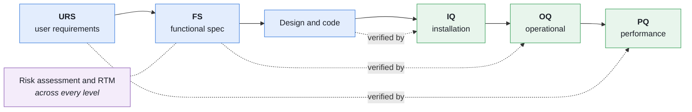

# CSV validation pack — Ricochet (article recommender)

> **Status: DRAFT — supporting material, still being written.**
> These documents are **assistive supporting material**, intended to be
> reviewed, completed and **approved by a qualified person (QA / CSV)** before
> any use. They are not a regulatory compliance decision.

## Purpose

Computerized System Validation (CSV) documentation for the **Ricochet** article
recommendation software, following a risk-based **GAMP 5 (2nd edition)**
approach.

## Note on proportionality (for QA to rule on)

As it stands, Ricochet is a consumer-facing reading-recommendation application:
**no GxP data** (patient, clinical, product quality) is processed, and the system
has no direct impact on patient safety or on the integrity of regulated data.
The **GxP impact is therefore assessed as low** (see the risk assessment). This
pack is provided either:

- as a reusable **methodology demonstration / template**, or
- to answer an **internal requirement** for quality oversight of the SDLC.

The actual validation effort must be adjusted to the risk by QA.

## GAMP classification

| Component | GAMP category | Justification |
|-----------|----------------|---------------|
| Operating system, Python runtime, Azure Functions, Blob Storage, Table Storage, Hugging Face Spaces (Docker SDK) | 1 — Infrastructure | Standard platforms and services |
| Libraries (numpy, scikit-learn, implicit, surprise, streamlit, huggingface_hub, azure-data-tables) | 3 — Non-configured product | Used as they are, unmodified |
| Recommendation engine (`src/`), Azure Function, HF Space, local application, artifact pipeline | 5 — Bespoke application | Purpose-written code |

## Document list

| ID | Document | Version | File |
|----|----------|---------|---------|
| MC-VAL-001 | Validation Plan (VP) | 0.2 | [01_Validation_Plan.md](01_Validation_Plan.md) |
| MC-URS-001 | User Requirements Specification (URS) | 0.2 | [02_URS.md](02_URS.md) |
| MC-FS-001 | Functional Specification (FS) | 0.2 | [03_Functional_Specification.md](03_Functional_Specification.md) |
| MC-RA-001 | Risk Assessment (RA) | 0.2 | [04_Risk_Assessment.md](04_Risk_Assessment.md) |
| MC-RTM-001 | Traceability Matrix (RTM) | 0.2 | [05_Traceability_Matrix.md](05_Traceability_Matrix.md) |
| MC-IQ-001 | Installation Qualification protocol (IQ) | 0.2 | [06_IQ_Protocol.md](06_IQ_Protocol.md) |
| MC-OQ-001 | Operational Qualification protocol (OQ) | 0.2 | [07_OQ_Protocol.md](07_OQ_Protocol.md) |
| MC-PQ-001 | Performance Qualification protocol (PQ) | 0.2 | [08_PQ_Protocol.md](08_PQ_Protocol.md) |
| MC-VSR-001 | Validation Summary Report (VSR) | 0.1 | [09_Validation_Summary_Report.md](09_Validation_Summary_Report.md) |

The `MC-` document identifiers are **kept from revision 0.1** even though the
system is now referred to as Ricochet: renumbering controlled documents would
break the traceability already recorded in the RTM, for no benefit.

Scope covered by revision 0.2 (2026-09-08): 22 requirements (URS), 28 functional
specifications (FS), 17 risks (RA), 17 OQ cases, 7 PQ cases, 9 IQ cases, and
87 unit tests serving as verification evidence.

**Still at 0.1**: the VSR, to be written once the protocols have been executed.

## Life cycle (V-model) and traceability

## Normative references (indicative)

- ISPE GAMP 5: A Risk-Based Approach to Compliant GxP Computerized Systems
  (2nd ed.).
- EU GMP Annex 11 — Computerised systems.
- FDA 21 CFR Part 11 — Electronic records and electronic signatures.
- **ALCOA+** data integrity principles.
