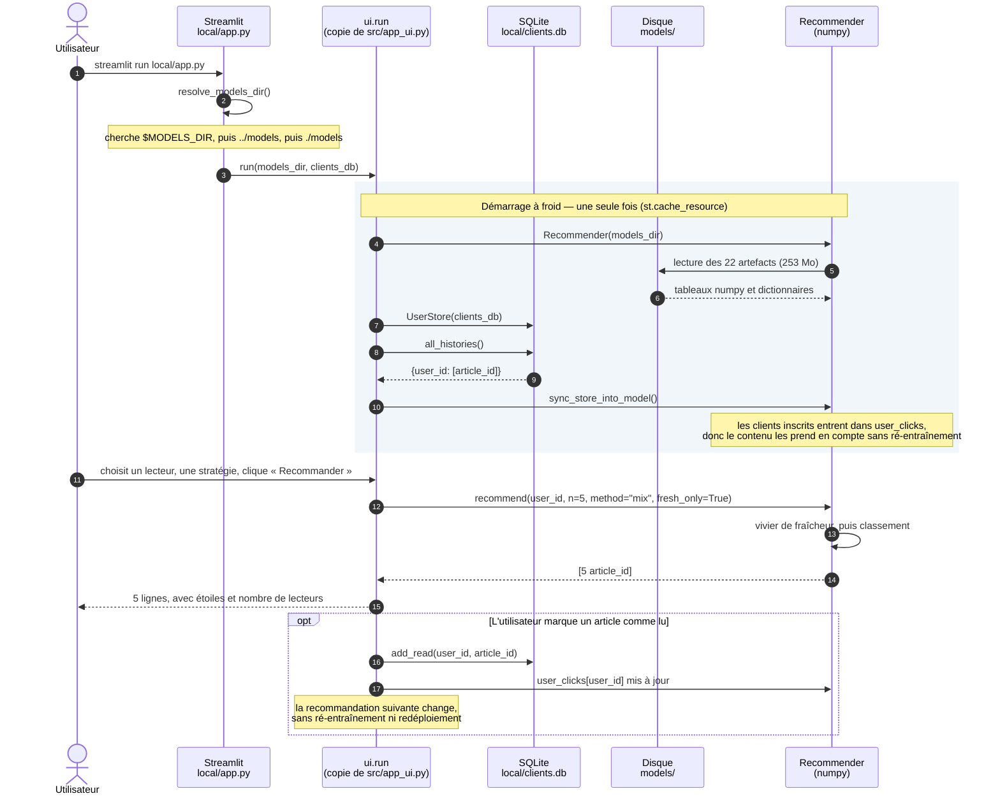
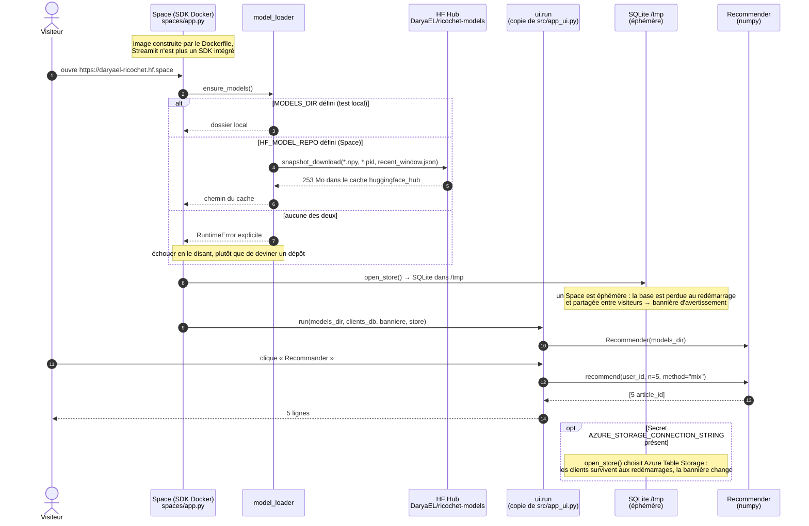
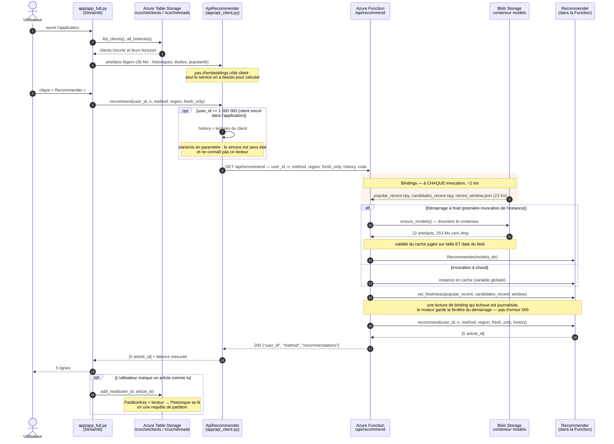

# Diagrammes de séquence — les trois solutions

Une requête de recommandation, de bout en bout, dans chacun des trois
déploiements. Les diagrammes suivent le code (`azure_function/function_app.py`,
`spaces/app.py`, `local/app.py`, `src/app_ui.py`) et non une intention : les noms
de méthodes sont ceux qui existent.

Ce que ces trois séquences font ressortir, et qui n'apparaît pas sur un schéma de
composants :

- **où le calcul a lieu** — dans le processus de l'interface (local, Hugging Face)
  ou derrière un appel réseau (Azure) ;
- **ce que coûte un démarrage à froid** et ce qu'il ne coûte qu'une fois ;
- **comment un lecteur inscrit à l'instant est recommandé** par un service qui ne
  le connaît pas.

Le cœur de recommandation est le même partout (`src/recommender.py`, numpy seul) ;
les copies déployées sont générées et la CI le vérifie.

---

## 1. Solution locale — tout dans un processus

**Ce que montre ce diagramme** : aucun appel réseau, et le modèle vit dans le
processus de l'interface. C'est la solution qui fonctionne dans un train, et celle
qui sert de référence de correction pour les deux autres (étape 2 du tutoriel de
déploiement).

---

## 2. Solution Hugging Face — même code, artefacts distants

**Ce que montre ce diagramme** : la seule différence avec la solution locale est
l'origine des artefacts. Le calcul reste dans le processus du Space — aucun appel
à Azure, les deux solutions sont indépendantes. Le disque n'étant pas persistant,
les 253 Mo sont retéléchargés à chaque démarrage à froid.

---

## 3. Solution Azure — architecture 2, calcul derrière le réseau

**Ce que montre ce diagramme** : les deux accès à Blob Storage, et pourquoi ils ne
sont pas au même endroit. Les 23 Ko de fraîcheur passent par des *bindings* relus à
chaque appel — une nouvelle fenêtre horaire s'applique **sans redémarrage**. Les
253 Mo passent par le SDK avec cache : un binding coûterait 8 s par appel au lieu
de 0,2 s.

Le paramètre `history` est ce qui rend le service utilisable pour un lecteur
inscrit une seconde plus tôt : la Function n'a aucun état, l'appelant apporte le
profil.

---

## Comparaison des trois séquences

| | Locale | Hugging Face | Azure |
|---|---|---|---|
| Où le classement est calculé | processus de l'interface | processus du Space | Azure Function |
| Origine des artefacts | disque | HF Hub (téléchargés au démarrage) | Blob Storage (binding + cache) |
| Appels réseau par recommandation | 0 | 0 | 1 |
| Clients inscrits | SQLite persistant | SQLite `/tmp`, éphémère | Table Storage, persistant |
| Coût du démarrage à froid | lecture disque | 253 Mo téléchargés | 253 Mo téléchargés, ~7,5 s |
| Recommandation à chaud | immédiate | immédiate | ~0,2 s |
| Mise à jour de la fenêtre de fraîcheur | régénérer les artefacts | republier le dépôt de modèle | **immédiate**, sans redémarrage |

Le tableau se lit dans un sens : plus on va vers Azure, plus le modèle est loin de
l'interface — et plus l'exploitation devient possible (mise à jour de la fraîcheur
sans interruption, mise à l'échelle, un seul modèle pour plusieurs clients).
