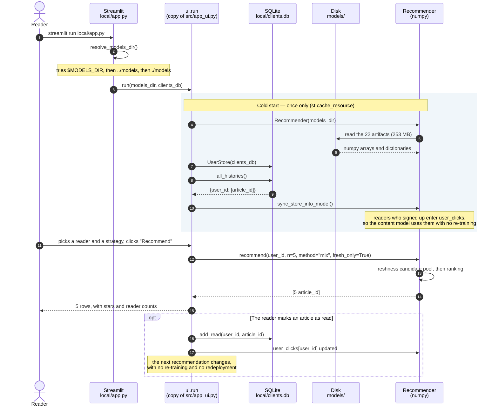
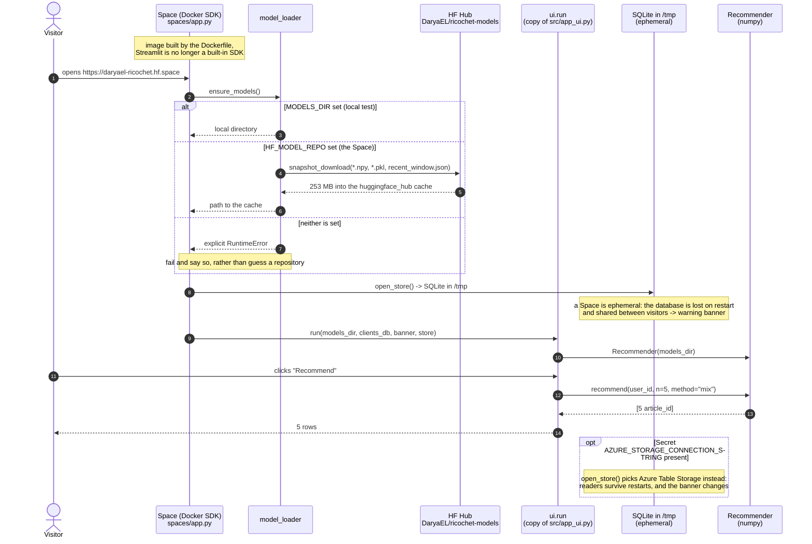
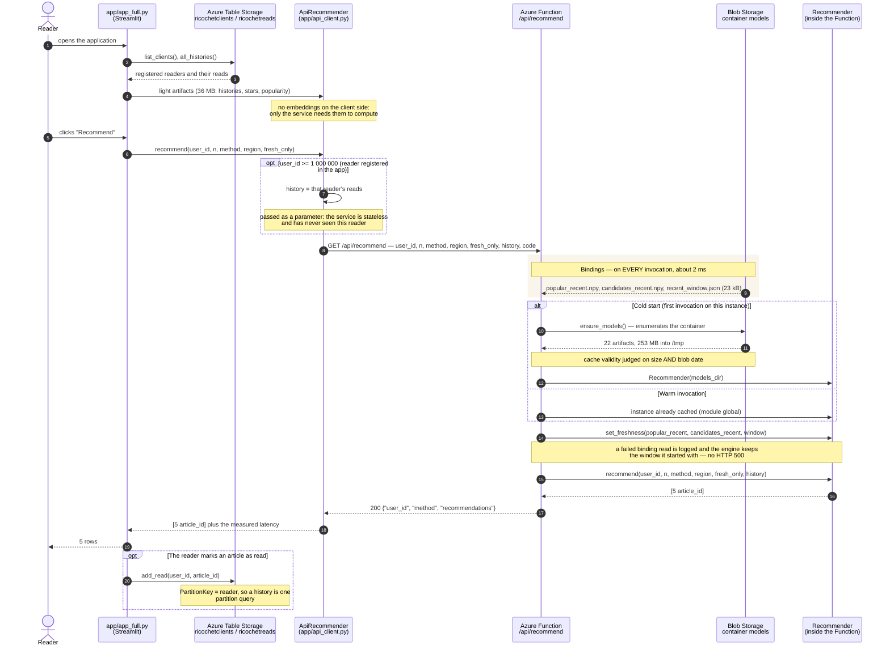

# Sequence diagrams — the three solutions

One recommendation request, end to end, in each of the three deployments. The
diagrams follow the code (`azure_function/function_app.py`, `spaces/app.py`,
`local/app.py`, `src/app_ui.py`) rather than an intention: the method names are
the ones that actually exist.

What these three sequences bring out, and a component diagram cannot:

- **where the computation happens** — inside the UI process (local, Hugging
  Face) or behind a network call (Azure);
- **what a cold start costs**, and what it only costs once;
- **how a reader who signed up a second ago** gets recommendations from a
  service that has never heard of them.

The recommendation core is the same everywhere (`src/recommender.py`, numpy
only); the deployed copies are generated, and CI checks that they match.

---

## 1. Local — everything in one process

**What this diagram shows**: no network call at all, and the model living inside
the UI process. This is the solution that works on a train, and the one used as
the correctness reference for the other two (step 2 of the deployment tutorial).

---

## 2. Hugging Face — same code, remote artifacts

**What this diagram shows**: the only difference from the local solution is where
the artifacts come from. The computation stays inside the Space process — no call
to Azure, the two solutions are independent. Since the disk is not persistent,
the 253 MB are downloaded again on every cold start.

---

## 3. Azure — architecture 2, computation behind the network

**What this diagram shows**: the two ways into Blob Storage, and why they are not
in the same place. The 23 kB of freshness go through *bindings* that are re-read
on every call, so a new hourly window applies **without a restart**. The 253 MB
go through the SDK with a cache: a binding there would cost 8 s per call instead
of 0.2 s.

The `history` parameter is what makes the service usable for a reader who signed
up one second earlier: the Function holds no state, so the caller brings the
profile with it.

---

## The three sequences compared

| | Local | Hugging Face | Azure |
|---|---|---|---|
| Where ranking is computed | UI process | Space process | Azure Function |
| Where artifacts come from | disk | HF Hub (downloaded at start-up) | Blob Storage (binding + cache) |
| Network calls per recommendation | 0 | 0 | 1 |
| Registered readers | persistent SQLite | SQLite in `/tmp`, ephemeral | Table Storage, persistent |
| Cold-start cost | disk read | 253 MB downloaded | 253 MB downloaded, about 7.5 s |
| Warm recommendation | immediate | immediate | about 0.2 s |
| Updating the freshness window | regenerate the artifacts | republish the model repository | **immediate**, no restart |

The table reads in one direction: the closer you get to Azure, the further the
model sits from the interface — and the more operable the whole thing becomes.
Freshness updated without an interruption, scaling, and one model serving several
clients.
